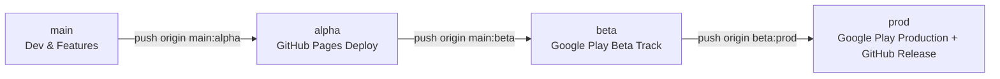

# Bussen App

<div align="center">

[](https://github.com/thijsvndmeer/bussenapp/releases)
[](https://github.com/thijsvndmeer/bussenapp/actions/workflows/playstore.yml)
[](LICENSE.md)

<br/>

[](https://play.google.com/store/apps/details?id=com.bussen.app)
[](https://thijsvndmeer.github.io/bussenapp/)

<p align="center">
  <strong>The ultimate companion app for the classic Dutch card-drinking game "Bussen" (Ride the Bus).</strong><br>
  Built with React 19, TypeScript, Tailwind CSS, and Capacitor for Android & Web.
</p>

</div>

---

## Download & Play

- **Android (Google Play):** [Get Bussen on Google Play](https://play.google.com/store/apps/details?id=com.bussen.app)
- **Web App (PWA):** [Play Online via GitHub Pages](https://thijsvndmeer.github.io/bussenapp/)

---

## Features

- **Automated Card Flow:** Handles card dealing, shuffling, and rule calculations automatically across all phases.
- **Phase 1: The Pyramid:** Build and climb the pyramid with custom heights, penalties, and interactive card flips.
- **Phase 2: Ride the Bus (Buschauffeur):** Dynamic bus ride with digital card navigation, drinking penalties, and shared bus mechanics.
- **Dynamic Themes:** Custom color palettes (Metro, Neon, Classic, Dark Mode) with sound and haptic effects.
- **Native Device APIs:** Full haptic feedback and status bar integration via Capacitor.
- **Offline & PWA Ready:** Playable offline in the browser or as an installed Android app.

---

## Tech Stack

- **Framework:** [React 19](https://react.dev/) + [TypeScript](https://www.typescriptlang.org/)
- **Bundler:** [Vite](https://vitejs.dev/)
- **Native Runtime:** [Capacitor 8](https://capacitorjs.com/) (Android & iOS)
- **Styling:** Tailwind CSS + Lucide Icons + Tabler Icons
- **CI/CD:** GitHub Actions (Automated Google Play Store deployment)

---

## CI/CD Pipeline & Branch Architecture

This repository uses a fully automated 4-stage branch promotion pipeline powered by GitHub Actions:



### Promotion Flow:

| Branch | Target Environment | Automation / Workflow |
|---|---|---|
| **`main`** | Development | Working branch. Direct commits and feature branches welcome. |
| **`alpha`** | **GitHub Pages** | Deploys instantly to [Web Demo](https://thijsvndmeer.github.io/bussenapp/) via `deploy.yml`. |
| **`beta`** | **Google Play (Beta Track)** | Runs TypeScript typecheck, Android Lint baseline check, compiles `.aab`, signs with keystore, and uploads to Google Play Beta track. |
| **`prod`** | **Google Play (Production) + GitHub Releases** | Deploys signed `.aab` to Google Play Production track and automatically creates a new GitHub Release with release notes and downloadable binaries. |

---

## Local Development

### Prerequisites
- **Node.js:** `>= 22.0.0`
- **npm:** `>= 10.0.0`
- **Android Studio & JDK 21:** (for local Android builds/emulation)

### Setup

```bash
# 1. Clone repository
git clone https://github.com/thijsvndmeer/bussenapp.git
cd bussenapp

# 2. Install dependencies
npm install

# 3. Start local development server
npm run dev

# 4. Typecheck TypeScript
npm run typecheck

# 5. Build production web bundle
npm run build
```

### Running on Android locally

```bash
# Build web bundle and sync native assets
npm run cap:android

# Open native Android project in Android Studio
npm run android
```

---

## Author & Maintainer

- **Thijs van der Meer** — [@thijsvndmeer](https://github.com/thijsvndmeer)

---

## Copyright & License

Copyright (c) 2026 Thijs van der Meer. All Rights Reserved.
See [LICENSE.md](file:///Users/thijsvandermeer/Downloads/bussenapp/LICENSE.md) for details.
